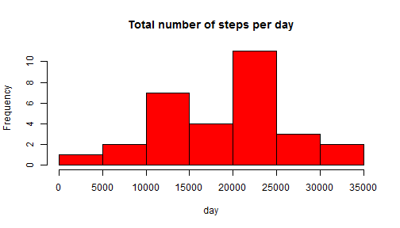
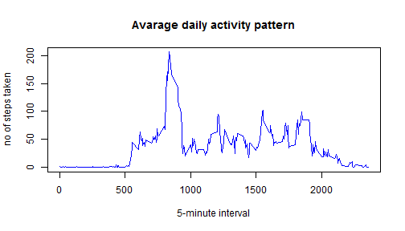
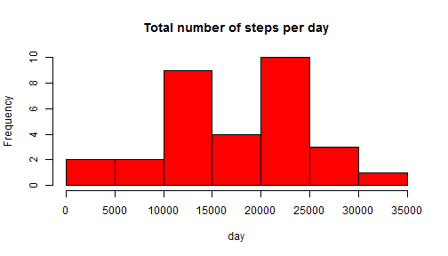
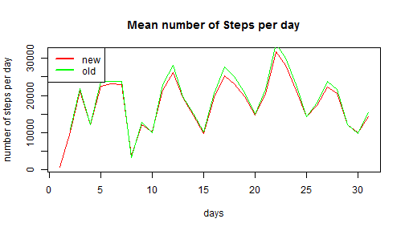
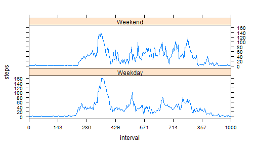

## Loading and preprocessing the data
library(knitr)
library(data.table)
library(plyr)
library(dplyr)
library(lubridate)
library(zoo)
library(lattice)

## Load the data (i.e. read.csv())

```r
##setwd("C:/DATA/COURSERA/05_REPRODUCIBLE/PA1")
data<-read.csv('activity.csv')
```

## What is mean total number of steps taken per day?

##=============
## PART 1
##=============


Calculate the total number of steps taken per day

```r
library(lubridate)
totalSteps_perDay<-aggregate(steps~day(data$date),data,sum,na.rm = TRUE)
colnames(totalSteps_perDay) <- c("day", "Total_steps_per_day")
```
Make a histogram of the total number of steps taken each day

```r
hist(totalSteps_perDay$Total_steps_per_day,
     col = "red", xlab="day",
     main="Total number of steps per day")
```

 
What is mean total number of steps taken per day?

```r
meanStepsPerDay<-aggregate(Total_steps_per_day~day,totalSteps_perDay,mean)
colnames(meanStepsPerDay) <- c("day", "mean_steps_per_day")
medianStepsPerDay<-aggregate(Total_steps_per_day~day,totalSteps_perDay,median)
colnames(medianStepsPerDay) <- c("day", "median_steps_per_day")
```


```r
print("mean value of the steps on all days")
```

```
## [1] "mean value of the steps on all days"
```

```r
mean(data$steps,na.rm=TRUE)
```

```
## [1] 37.3826
```

```r
print("median value of the steps on all days")
```

```
## [1] "median value of the steps on all days"
```

```r
median(data$steps,na.rm=TRUE)
```

```
## [1] 0
```
 What is the average daily activity pattern?

##=================
## PART 2
##=================


Make a time series plot (i.e. type = "l") 
of the 5-minute interval (x-axis) and the average number of
steps taken, averaged across all days (y-axis)

```r
ts<-aggregate(steps~interval,data,mean,na.rm=TRUE)

plot(ts$interval,ts$steps,type="l",
     main="Avarage daily activity pattern",
     xlab="5-minute interval",
     ylab="no of steps taken",
     col="blue")
```

 
Which 5-minute interval, on average across all the days in 
the dataset, contains the maximum number of steps?

```r
max(ts$steps)
```

```
## [1] 206.1698
```

```r
print("value coresponding--")
```

```
## [1] "value coresponding--"
```

```r
which.max(ts$steps)
```

```
## [1] 104
```


## Imputing missing values

##=================
## PART 3
##================= 
  

Calculate and report the total number of missing 
values in the dataset (i.e. the total number of rows with NAs)

```r
print("missing values in data")
```

```
## [1] "missing values in data"
```

```r
data_na<-sum(is.na(data))
cdata_na<-which(is.na(data))
```

Devise a strategy for filling in all of the missing values
in the dataset. The strategy does not need to be sophisticated.
For example, you could use the mean/median for that day, or the
mean for that 5-minute interval, etc.

Create a new dataset that is equal to the original dataset
but with the missing data filled in.

for this calculation I use the zoo library

data1 is the new data set

```r
library(zoo)
data1<-zoo(data)
data1<-na.locf(data1,from.LAST=TRUE)
sum(is.na(data1))
```

```
## [1] 288
```

```r
data1<-na.fill(data1, c("extend", NA))
sum(is.na(data1))
```

```
## [1] 0
```

```r
class(data1)
```

```
## [1] "zoo"
```

```r
## transforming the data1 from zoo class to data.frame
library(data.table)
data1<-data.frame(data1)
data1<-data.table(data1)
```
Make a histogram of the total number of steps taken each day 


```r
totalSteps_perDay1<-as.data.frame(tapply(as.numeric(data1$steps), as.numeric(day(data1$date)), sum))
## write the days in the same data.frame
totalSteps_perDay1[[2]]<-unique(day(data1$date))

colnames(totalSteps_perDay1) <- c( "Total_steps_per_day","day")
hist(totalSteps_perDay1$Total_steps_per_day,
     col = "red", xlab="day",
     main="Total number of steps per day")
```

 

Calculate and report the mean and median total number of 
steps taken per day. 

```r
meanStepsPerDay1<-aggregate(Total_steps_per_day~day,totalSteps_perDay1,mean)
colnames(meanStepsPerDay1) <- c("day", "mean_steps_per_day")
medianStepsPerDay1<-aggregate(Total_steps_per_day~day,totalSteps_perDay1,median)
colnames(medianStepsPerDay1) <- c("day", "median_steps_per_day")
```

Do these values differ from the estimates
from the first part of the assignment? 

```r
plot( meanStepsPerDay1$day,
    meanStepsPerDay1$mean_steps_per_day,
     col="red",
     type="l",
     main="Mean number of Steps per day",
     ylab="number of steps per day",
     xlab="days")
lines(meanStepsPerDay$day,
      meanStepsPerDay$mean_steps_per_day,
      col="green")
legend("topleft", 
       legend = c("new", "old"),
       lty=c(1,1),
       lwd=c(2.5,2.5),col=c("red","green"))
```

 

What is the impact of 
imputing missing data on the estimates of the total daily
number of steps?

The result will be more accurate
accuracy measured in mean number of steps

```r
accuracy<-meanStepsPerDay$Total_steps_per_day[1:30]-meanStepsPerDay1$Total_steps_per_day[1:30]
```


## Are there differences in activity patterns between weekdays and weekends?

##=================
##PART 4
##=================

the dataset with 
the filled-in missing values for this part.

```r
data1[[4]]<-weekdays(day(data1$date))
data1[[5]]<-"empty"

data1$V5[data1$V4 == "Mon"] <- "Weekday"
data1$V5[data1$V4 == "Tue"] <- "Weekday"
data1$V5[data1$V4 == "Wed"] <- "Weekday"
data1$V5[data1$V4 == "Thu"] <- "Weekday"
data1$V5[data1$V4 == "Fri"] <- "Weekday"
data1$V5[data1$V4 == "Sat"] <- "Weekend"
data1$V5[data1$V4 == "Sun"] <- "Weekend"
```
Make a panel plot containing a time series plot 
(i.e. type = "l") of the 5-minute interval (x-axis)
and the average number of steps taken, averaged across 
all weekday days or weekend days (y-axis). See the README 
file in the GitHub repository to see an example of what this
plot should look like using simulated data.

```r
library(lattice)

meansteps <- aggregate(as.numeric(data1$steps), by = list(data1$interval, data1$V5), mean)
names(meansteps) <- c("interval", "dtype", "steps")

x.tick.number <- 15
at <- seq(1, nrow(meansteps), length.out=x.tick.number)
labels <- round(seq(0, 2000, length.out=x.tick.number))

xyplot(steps~interval|dtype, 
       data=meansteps, type='l', layout=c(1, 2),
       scales=list(y=list(tick.number=10), 
                   x=list(at=at, labels=labels)))
```

 
